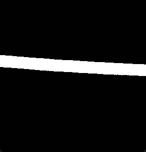

# PowerLineVision - 输电线检测与轮廓提取系统

A computer vision system for power line detection and precise contour extraction using YOLO-OBB detection and OpenCV post-processing.

## 项目概述

本项目是一个智能输电线检测系统，结合了深度学习目标检测和传统计算机视觉技术，用于自动检测输电线路并提取精确的轮廓掩码。

### 核心功能

- **YOLO-OBB检测**：使用旋转边界框检测输电线
- **图像二值化**：多种二值化算法优化轮廓提取
- **轮廓精化**：从检测框内提取精确的输电线轮廓
- **多语言支持**：Python + Java实现
- **可视化工具**：完整的GUI界面和结果展示

## 技术架构

### 检测流程
1. **YOLO-OBB检测**：检测输电线并返回旋转边界框
2. **区域提取**：从检测框内提取输电线区域
3. **图像预处理**：去噪、增强对比度
4. **二值化处理**：OTSU/自适应阈值二值化
5. **轮廓提取**：形态学操作 + 轮廓检测
6. **轮廓精化**：均匀采样得到精确轮廓点

### 文件结构

```
PowerLineVision/
├── simple_detect.py          # 核心检测脚本
├── yolo_obb_inference.py    # 完整推理应用
├── image_binarization.py    # 二值化处理工具
├── ContourExtractor.java    # Java轮廓提取器
├── best.pt                  # YOLO-OBB模型
├── ultralytics/             # YOLO模型库
└── README.md               # 项目文档
```

## 安装与使用

### 环境要求

- Python 3.8+
- Java 8+
- OpenCV 4.x
- PyTorch
- Ultralytics

### Python环境

```bash
# 安装依赖
pip install ultralytics opencv-python numpy torch
pip install pillow tkinter

# 运行检测
python simple_detect.py
```

### Java环境

```bash
# 编译Java代码
mvn clean compile
mvn exec:java
```

## 使用方法

### 基本检测

```python
# 加载模型
model = YOLO('best.pt')

# 检测输电线
results = model(image, conf=0.25)

# 提取轮廓
for detection in results[0].obb.data:
    x, y, w, h, angle, conf, cls = detection[:7]
    contour_points = extract_contour_from_rotated_rect(
        image, x, y, w, h, angle, sample_points=200
    )
```

### 二值化处理

```python
# 多种二值化方法
binary = improved_binarization(gray_image, method='adaptive')
# 可选方法: 'otsu', 'adaptive', 'triangle', 'mixed'
```

### Java轮廓提取

```java
// 提取轮廓点
MatOfPoint2f contourPoints = ContourExtractor.extractContourFromRotatedRect(
    image, x, y, w, h, angle, samplePoints
);
```

## 核心算法

### 1. YOLO-OBB检测
- 使用预训练的YOLO-OBB模型
- 检测输电线并返回旋转边界框
- 支持置信度阈值调整

### 2. 图像预处理
- 高斯滤波去噪
- CLAHE对比度增强
- 自适应直方图均衡化

### 3. 二值化优化
- **OTSU方法**：适合双峰直方图
- **自适应阈值**：适合光照不均
- **Triangle方法**：适合单峰直方图
- **混合方法**：结合多种策略

### 4. 轮廓提取
- 形态学操作连接分离区域
- 轮廓检测与合并
- 基于弧长的均匀采样

## 配置参数

### 检测参数
- `conf`: 置信度阈值 (默认: 0.25)
- `sample_points`: 轮廓采样点数 (默认: 200)

### 二值化参数
- `method`: 二值化方法 ('adaptive', 'otsu', 'triangle', 'mixed')
- `kernel_size`: 形态学核大小 (默认: 3x3)

## 示例结果

### 检测效果展示





*上图展示了系统对输电线的检测和轮廓提取效果*

系统能够：
- 准确检测各种角度和光照条件下的输电线
- 提取精确的轮廓掩码
- 提供可视化的检测结果
- 支持批量处理

## 注意事项

1. 确保模型文件 `best.pt` 存在
2. 输入图像应为RGB格式
3. 检测结果基于训练数据的类别
4. 轮廓提取质量取决于二值化效果

## 技术特点

- **高精度检测**：YOLO-OBB提供准确的旋转边界框
- **鲁棒二值化**：多种算法适应不同图像条件
- **精确轮廓**：基于弧长的均匀采样
- **跨平台支持**：Python + Java双语言实现
- **易于扩展**：模块化设计便于功能扩展

## 应用场景

- 电力线路巡检
- 输电线状态监测
- 自动化检测系统
- 计算机视觉研究
